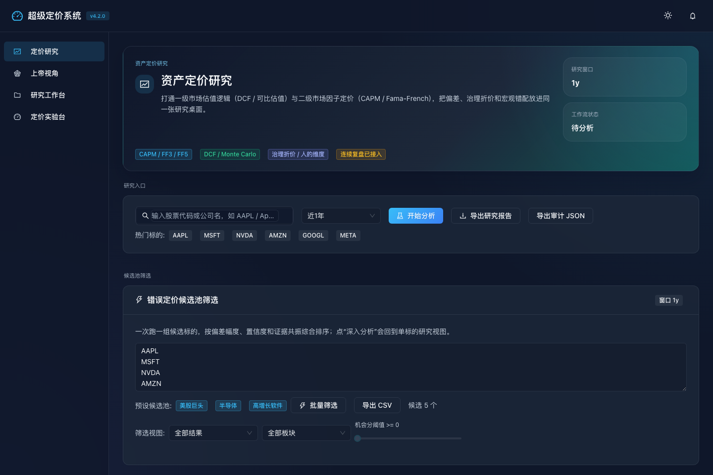
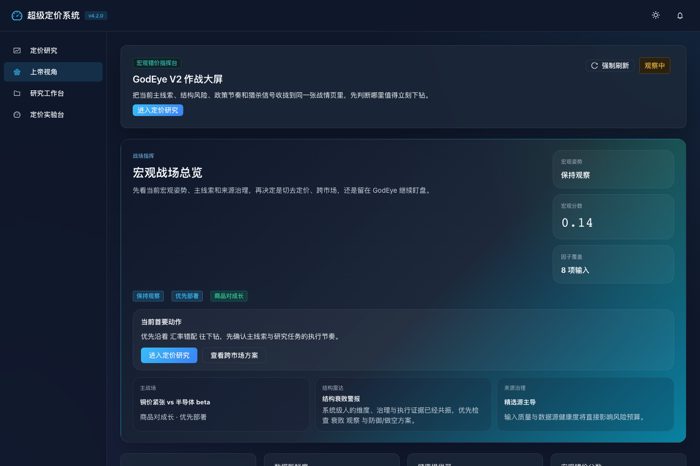
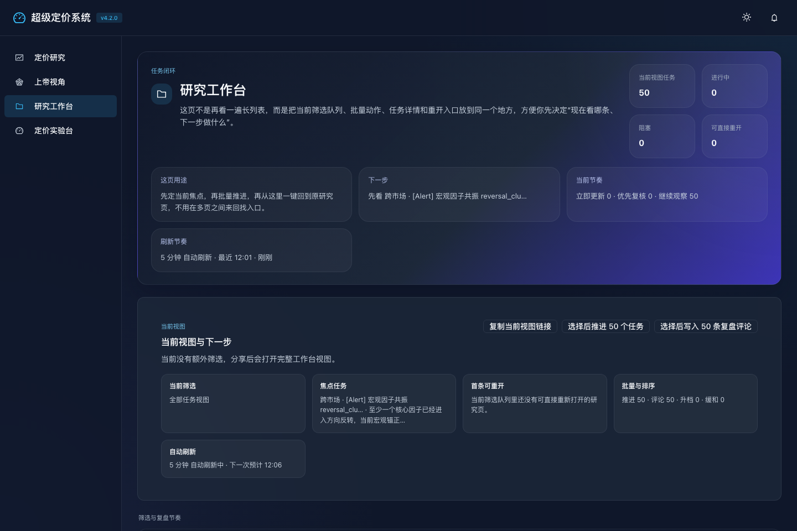
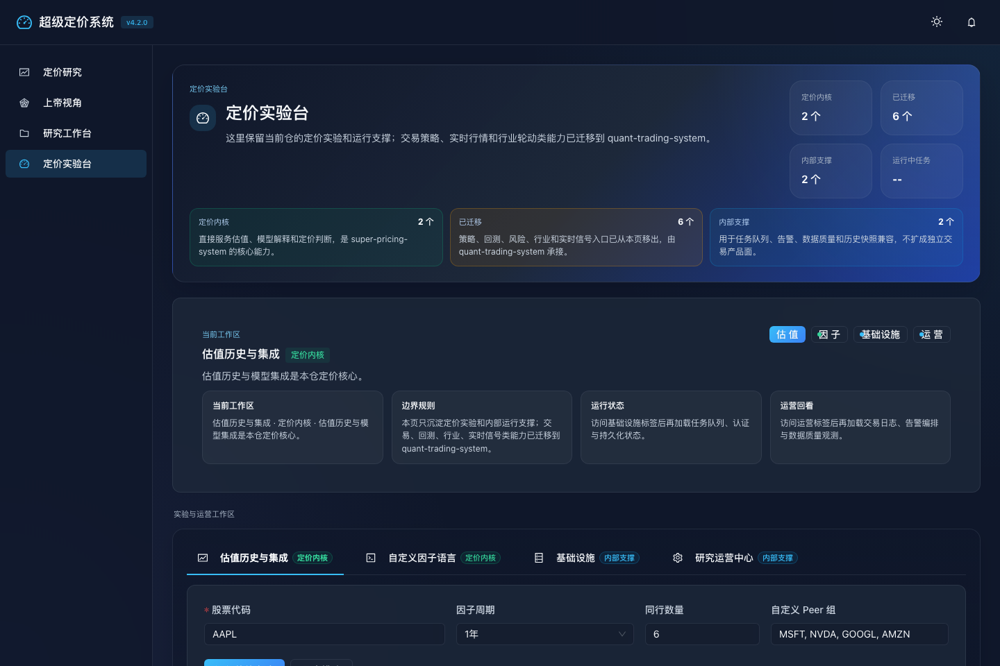
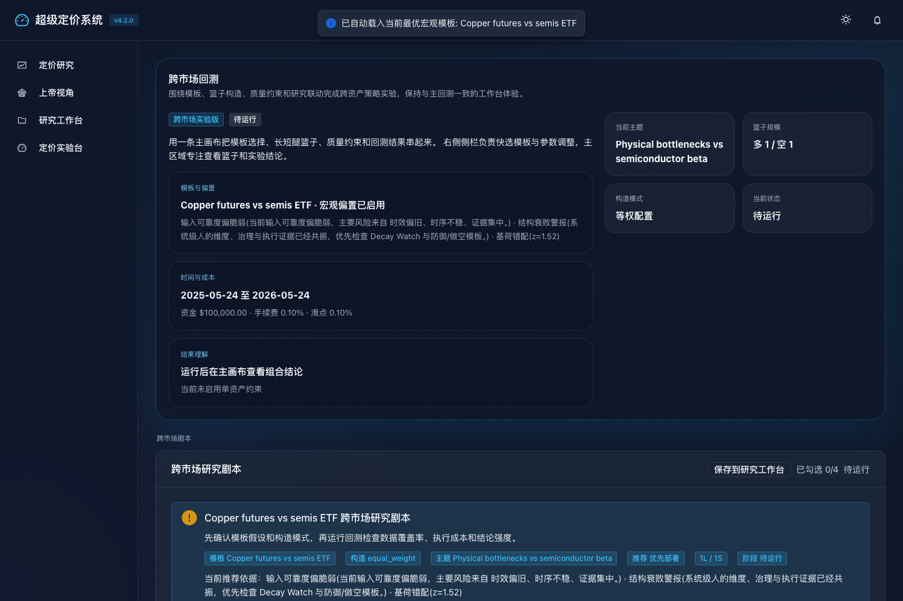

<div align="center">


<br />

# 🏛️ Super Pricing System

**宏观错误定价套利引擎 · Macro Mispricing Arbitrage Engine**

*一套面向 A 股市场的全链路量化研究系统，覆盖定价研究、宏观因子监控、另类数据挖掘、跨市场回测与研究运营闭环。*

**当前版本：`v4.2.0`** · [查看更新日志](docs/CHANGELOG.md)

[](https://www.python.org/)
[](https://fastapi.tiangolo.com/)
[](https://react.dev/)
[](./LICENSE)

[](https://github.com/Leonard-Don/super-pricing-system/actions/workflows/ci.yml)
[](https://github.com/Leonard-Don/super-pricing-system/releases/latest)

<br />

> 💰 定价研究 · 🛰️ 上帝视角 · 📂 研究工作台 · 🧪 定价实验台 — **4** 大核心工作区 · **11** 类 API 分组 · **30+** 运维脚本

[本地体验](#-本地体验) · [核心模块](#-核心模块) · [页面预览](#-页面预览) · [快速开始](#-快速开始) · [系统架构](#-系统架构) · [测试](#-测试) · [API 参考](docs/API_REFERENCE.md)

</div>

---

## 📬 合作与交流 · Collaboration & Contact

If you're building quantitative research systems, data pipelines, research dashboards, or local-first financial tools, feel free to:
- 📝 Open an [Issue](https://github.com/Leonard-Don/super-pricing-system/issues) for questions, ideas, or discussions
- 🤝 PRs welcome (please open an Issue first to align on direction)
- ⭐ Star the repo if it helped you think about your own quant stack

如果你也在做量化研究系统、数据管线、研究 Dashboard 或本地优先金融工具，欢迎：
- 📝 在 [Issues](https://github.com/Leonard-Don/super-pricing-system/issues) 提问、讨论想法或反馈
- 🤝 PR 欢迎（建议先开 Issue 对齐方向）
- ⭐ 觉得对你的量化栈思考有帮助的话，star 一下

---

## 🎯 系统定位

本仓库是一个独立维护的量化研究项目，专注于以下四大核心方向：

| 工作区 | 图标 | 说明 |
|--------|------|------|
| **定价研究** | 💰 | CAPM / Fama-French 三因子 / DCF 估值 / Gap Analysis |
| **上帝视角 (GodEye)** | 🛰️ | 宏观因子引擎 · 证据质量 · 政策雷达 · 结构性衰败 · 跨市场总览 |
| **研究工作台** | 📂 | 研究任务持久化 · 状态流转 · 深链重开 · 剧本联动 |
| **定价实验台 (Quant Lab)** | 🧪 | 估值历史 · 自定义因子 · 内部运行支撑；交易策略/回测/行业/实时信号路由仍在后端运行，但已从公开 OpenAPI 文档隐藏 |

### 🎯 这个仓适合谁

- 需要**多模型定价分析**能力，CAPM / FF3 / DCF 一键对比，发现错误定价
- 需要**宏观因子监控**和**证据质量引擎**，从源头追踪因子的可信度和衰变
- 需要一个完整的**研究运营闭环**，从发现到建模到回测到执行的全链路
- 需要**另类数据管道**：政策雷达、治理数据、人事脆弱性、供应链信号

### 🔎 GitHub 首页导航

| 如果你想先看 | 入口 |
|------|------|
| 🖼️ 系统实际长什么样 | [本地体验](#-本地体验) + [页面预览](#-页面预览) |
| ⚡ 怎么最快启动 | [快速开始](#-快速开始) |
| 🔌 提供了哪些 API | [API 路由](#-api-路由) + [API 参考](docs/API_REFERENCE.md) |
| 📝 最近版本改了什么 | [更新日志](docs/CHANGELOG.md) |

---

## 🧭 本地体验

> 当前不提供在线 Demo。请在本地启动前后端后体验完整功能。

### 30 秒启动

```bash
git clone https://github.com/Leonard-Don/super-pricing-system.git
cd super-pricing-system
cp .env.example .env
./scripts/start_system.sh
```

### 启动后可访问

| 页面 | 地址 | 说明 |
|------|------|------|
| 💰 定价研究 | `http://localhost:3100?view=pricing` | CAPM / FF3 / DCF / Gap Analysis |
| 🛰️ 上帝视角 | `http://localhost:3100?view=godsEye` | 宏观因子 · 证据质量 · 政策雷达 · 跨市场总览 |
| 📂 研究工作台 | `http://localhost:3100?view=workbench` | 研究任务持久化 · 状态流转 · 深链重开 |
| 🧪 定价实验台 | `http://localhost:3100?view=quantlab` | 估值历史 · 自定义因子 · 运行支撑 · 收口后的工作区边界 |
| 📖 API 文档 | `http://localhost:8100/docs` | OpenAPI 交互式文档 |

### 💡 推荐体验路径

1. 先进入 **定价研究**，完成标的检索、多模型估值和理论价格判断
2. 再切到 **上帝视角**，查看宏观因子、证据质量和跨市场叙事切换
3. 接着进入 **研究工作台**，验证任务卡、状态流转和深链重开
4. 最后进入 **定价实验台**，核对估值实验、因子表达式和内部运行状态；交易策略、回测、行业轮动和实时信号类能力的前端页面已从这四个工作区移除,对应的后端路由和 `src/` 引擎模块仍作为内部运行支撑保留,只是已从公开 OpenAPI 文档隐藏

---

## 🧩 核心模块

### 💰 定价研究 (Pricing Research)

多模型定价分析引擎，支持标的快速检索与同行对比：

- **CAPM 模型** — 市场风险溢价估算与 β 系数分析
- **Fama-French 三因子** — 规模/价值因子暴露计算
- **DCF 现金流折现** — 自由现金流建模与敏感性分析
- **Gap Analysis** — 市场价格与理论价值的偏离度分析，识别潜在套利机会
- **估值支撑解释** — 多模型交叉验证与定价结论可解释性

### 🛰️ 上帝视角 (GodEye Dashboard)

宏观错误定价监控总部，集成多因子可靠度引擎：

- **宏观因子雷达** — 官僚摩擦 / 基荷错位 / 技术稀释 / 人事脆弱性 / 利率曲线压力 / 信用利差压力 / 汇率错配
- **证据质量引擎** — 来源可信度 · 冲突/漂移/断流诊断 · 跨源确认 · 反转前兆 · 因子共振
- **结构性衰败监控** — people / governance / execution / physical / evidence 维度雷达
- **部门混乱看板** — 政策执行紊乱监控与部门注意力碎片化分析
- **政策时间线** — 官方 feed + 正文抓取 + source health 诊断
- **跨市场总览** — 多市场联动关系与叙事切换预警

### 📂 研究工作台 (Research Workbench)

持久化研究运营中心，驱动从发现到执行的研究闭环：

- **研究卡片管理** — 后端持久化任务卡 · 状态流转 · 深链重开
- **快照解释与版本对比** — recommendation / allocation / bias / driver 主题变化追踪
- **研究剧本联动** — 与 GodEye、定价研究、跨市场回测的保存与重开闭环
- **共振驱动优先级** — 自动降级 · 核心腿受压 · 直达 deep link

### 🧪 定价实验台 (Quant Lab)

本仓不再把 Quant Lab 当成独立交易产品面，而是收口为定价实验与内部运行支撑：

- **定价内核** — 估值历史回溯 · 模型集成 · 自定义因子表达式
- **收口入口** — 策略优化 · 回测增强 · 风险归因 · 行业轮动 · 实时信号验证已从 Quant Lab 前端入口移除；对应后端路由仍在本仓挂载并作为内部运行支撑维护,只是已从公开 OpenAPI 文档隐藏,更偏交易方向的进一步开发可放到 `quant-trading-system`
- **内部支撑** — 任务队列 · 告警编排 · 数据质量 · 历史快照兼容

---

## 🖼️ 页面预览

<table>
  <tr>
    <td align="center" width="50%">
      
      <br />
      <strong>资产定价研究</strong><br />
      <sub>CAPM / Fama-French / DCF / Monte Carlo 与研究卡片入口</sub>
    </td>
    <td align="center" width="50%">
      
      <br />
      <strong>GodEye 作战大屏</strong><br />
      <sub>宏观、政策、另类数据与研究候选任务汇总</sub>
    </td>
  </tr>
  <tr>
    <td align="center" width="50%">
      
      <br />
      <strong>研究工作台</strong><br />
      <sub>任务卡、快照、状态流转与复盘闭环</sub>
    </td>
    <td align="center" width="50%">
      
      <br />
      <strong>定价实验台</strong><br />
      <sub>估值实验、因子表达式与内部任务/告警支撑</sub>
    </td>
  </tr>
</table>

<p align="center">
  
  <br />
  <sub>跨市场回测：从定价实验台跳转到跨资产研究剧本</sub>
</p>

> 本地页面入口见上方"本地体验"。如果你想直接验证当前主应用链路，推荐在 `tests/e2e/` 下运行端到端验证。

---

## 🏗️ 系统架构

```
┌─────────────────────────────────────────────────────────────────┐
│                      Frontend (React 18)                        │
│  ┌──────────┐ ┌──────────┐ ┌──────────────┐ ┌───────────────┐  │
│  │ 定价研究  │ │ GodEye   │ │ 研究工作台    │ │ 定价实验台     │  │
│  │ Pricing  │ │ Dashboard│ │ Workbench    │ │ Pricing Lab   │  │
│  └──────────┘ └──────────┘ └──────────────┘ └───────────────┘  │
│                Ant Design · Recharts · Lightweight Charts       │
├───────────────────────┬─────────────────────────────────────────┤
│     REST API (v1)     │           WebSocket                     │
├───────────────────────┴─────────────────────────────────────────┤
│                   Backend (FastAPI + Uvicorn)                    │
│  ┌────────────┐ ┌────────────┐ ┌────────────┐ ┌─────────────┐  │
│  │ Pricing API│ │ Macro API  │ │Workbench   │ │QuantLab API │  │
│  │ AltData API│ │ Evidence   │ │ API        │ │Alerts API   │  │
│  └────────────┘ └────────────┘ └────────────┘ └─────────────┘  │
├─────────────────────────────────────────────────────────────────┤
│                     Core Engine (src/)                           │
│  ┌───────────┐ ┌──────────┐ ┌──────────┐ ┌──────────────────┐  │
│  │ Analytics  │ │ Backtest │ │ Strategy │ │ Alternative Data │  │
│  │ (28+ 模块) │ │  Engine  │ │ Library  │ │    Pipeline      │  │
│  └───────────┘ └──────────┘ └──────────┘ └──────────────────┘  │
├─────────────────────────────────────────────────────────────────┤
│                     Infrastructure                               │
│        TimescaleDB · Redis · Celery · Prometheus                 │
└─────────────────────────────────────────────────────────────────┘
```

### 技术栈

<table>
<tr><td>

**后端**

| 组件 | 技术 |
|------|------|
| Web 框架 | FastAPI 0.100+ · Uvicorn · Pydantic v2 |
| 数据处理 | Pandas · NumPy · SciPy · scikit-learn |
| 金融数据 | AKShare · yfinance · pandas-datareader |
| 异步 & 任务 | aiohttp · asyncio · APScheduler · Celery（可选 broker 模式） |
| 实时通信 | WebSocket (websockets 12+) |
| 数据库 | TimescaleDB (PostgreSQL 16) · Redis 7 |
| 监控 | Prometheus · psutil |

</td><td>

**前端 & 基础设施**

| 组件 | 技术 |
|------|------|
| 框架 | React 18 · Create React App |
| UI 库 | Ant Design 5 · @ant-design/icons |
| 图表 | Recharts · Lightweight Charts |
| 网络 | Axios · WebSocket |
| 工具 | dayjs · lodash · jsPDF |
| 基础设施（可选） | TimescaleDB · Redis · Celery |
| CI/CD | GitHub Actions |

</td></tr>
</table>

---

## 🔌 API 路由

> 下表只列出当前四大工作区对应的 API。`backtest / realtime / industry / trade`
> 等路由仍在本仓后端挂载,作为定价实验台和历史任务的运行时支撑,但不作为
> `super-pricing-system` 的主产品边界展示,因此从公开 OpenAPI 文档隐藏(详见下方
> 隐藏路由清单)。

| 路由前缀 | 模块 | 说明 |
|----------|------|------|
| `/pricing/*` | 💰 定价研究 | 标的搜索 · 多模型定价 · 同行对比 · 敏感性分析 |
| `/pricing-support/*` | 定价支撑 | 基准因子摘要 · 估值支撑解释 |
| `/alt-data/*` | 另类数据 | 供应链 · 治理 · 人事 · 政策源 · 实体统一 |
| `/macro/*` | 🛰️ 宏观引擎 | 因子可靠度 · 冲突诊断 · 衰败监控 · 部门混乱 |
| `/research-workbench/*` | 📂 研究工作台 | 任务卡 CRUD · 状态流转 · 快照 |
| `/quant-lab/*` | 🧪 定价实验台 | 估值实验 · 因子表达式 · 内部任务/告警；交易类实验已从前端入口移除,后端路由仍作内部支撑 |
| `/cross-market/*` | 内部跨市场复盘 | GodEye / Workbench 深链重开与组合验证 |
| `/infrastructure/*` | 系统支撑 | 认证 · 令牌管理 · 通知 · 本地运行状态 |

以下路由仍在后端挂载以兼容定价实验台、旧快照和本地验证脚本，但已从生成的
OpenAPI/Postman 主文档隐藏：`/market-data/*`、`/strategies/*`、`/backtest/*`、
`/realtime/*`、`/trade/*`、`/industry/*`、`/analysis/*`、`/events/*`、`/optimization/*`。

---

## 🚀 快速开始

### 环境要求

| 依赖 | 最低版本 | 推荐版本 |
|------|----------|----------|
| Python | `3.10+` | `3.13` |
| Node.js | `16+` | `22` |
| npm | `8+` | `10+` |
| Docker | 可选 | `24+` (用于 TimescaleDB + Redis) |

### 1. 克隆与配置

```bash
git clone https://github.com/Leonard-Don/super-pricing-system.git
cd super-pricing-system
cp .env.example .env
```

### 2. 安装依赖

```bash
# 后端依赖
pip install -r requirements.txt

# 前端依赖
cd frontend && npm install && cd ..
```

### 3. 启动系统

**最简启动（无需 Docker，使用本地 ThreadPoolExecutor 任务队列）：**

```bash
./scripts/start_system.sh
```

> 默认任务执行器为内置 `ThreadPoolExecutor`；只有显式启用 `--with-worker`
> 并配置 `CELERY_BROKER_URL` / `REDIS_URL` 时才会切换到 Celery 调度。

**完整启动（含基础设施 + Celery Worker）：**

```bash
./scripts/start_system.sh --with-infra --with-worker --bootstrap-persistence
```

### 4. 验证

```bash
# 健康检查
python3 ./scripts/health_check.py

# 打开浏览器
# 前端: http://localhost:3100
# API:  http://localhost:8100/docs
```

### 5. 停止系统

```bash
# 仅前后端
./scripts/stop_system.sh

# 含基础设施和 Worker
./scripts/stop_system.sh --with-infra --with-worker
```

---

## 🧪 测试

```bash
# 运行全部测试（unit + integration + system）
python scripts/run_tests.py

# 仅单元测试
python scripts/run_tests.py --unit

# 仅集成测试
python scripts/run_tests.py --integration

# 前端测试
cd frontend && CI=1 npm test -- --runInBand --watchAll=false

# 覆盖率报告
python scripts/run_tests.py --coverage
```

> 详细说明请参阅 [测试指南](docs/TESTING_GUIDE.md)

---

## 📦 部署

### 开发环境

```bash
pip install -r requirements-dev.txt
cd frontend && npm install && cd ..
./scripts/start_system.sh
```

### 生产环境

```bash
# 后端
API_RELOAD=false python backend/main.py

# 前端构建
cd frontend && npm run build
```

### 基础设施（Docker）

```bash
# 启动 TimescaleDB + Redis
./scripts/start_infra_stack.sh --bootstrap-persistence

# 启动 Celery Worker
./scripts/start_celery_worker.sh

# 数据迁移
python3 ./scripts/migrate_infra_store.py --apply
```

> 若未安装 Docker，系统可自动降级为 SQLite + 本地执行器运行。
>
> 支持 Nginx 反向代理部署，详见 [部署指南](docs/DEPLOYMENT.md)。

---

## 📁 目录结构

```
super-pricing-system/
├── backend/                         # FastAPI 后端应用
│   ├── main.py                      # 应用入口 & Uvicorn 启动
│   └── app/
│       ├── api/v1/endpoints/        # REST API 路由（按前缀分目录）
│       ├── core/                    # 配置中心 & 应用核心
│       ├── db/                      # TimescaleDB Schema & 迁移
│       ├── schemas/                 # Pydantic 请求/响应模型
│       ├── services/                # 业务服务层 (QuantLab 7 服务)
│       └── websocket/               # 实时行情 & 交易推送
│
├── frontend/                        # React 前端应用
│   └── src/
│       ├── components/              # 40+ 页面组件
│       │   ├── pricing/             # 定价研究 UI (11 组件)
│       │   ├── GodEyeDashboard/     # 上帝视角 UI (29 组件)
│       │   ├── research-workbench/  # 研究工作台 UI (18 组件)
│       │   ├── quant-lab/           # 定价实验台 UI (49 组件)
│       │   └── ...
│       ├── hooks/                   # 自定义 React Hooks
│       ├── services/                # API 调用封装
│       └── i18n/                    # 国际化
│
├── src/                             # 核心计算引擎
│   ├── analytics/                   # 分析模块 (26+ 引擎)
│   ├── backtest/                    # 回测引擎 (14 模块)
│   ├── data/                        # 数据层
│   │   ├── alternative/             # 另类数据管道
│   │   └── providers/               # 多数据源适配器
│   ├── strategy/                    # 策略库
│   └── research/                    # 研究工作台核心
│
├── tests/                           # 测试套件
│   ├── unit/                        # 单元测试
│   ├── integration/                 # 集成测试
│   └── e2e/                         # 浏览器端到端回归
│
├── scripts/                         # 运维脚本 (30+)
├── docs/                            # 项目文档
├── docker-compose.pricing-infra.yml # 基础设施编排
└── VERSION                          # 当前版本: 4.2.0
```

---

## 📚 相关文档

| 文档 | 说明 |
|------|------|
| [API 参考手册](docs/API_REFERENCE.md) | 完整 API 端点说明 |
| [更新日志](docs/CHANGELOG.md) | 版本发布记录 |
| [部署指南](docs/DEPLOYMENT.md) | 开发/生产环境部署 |
| [测试指南](docs/TESTING_GUIDE.md) | 测试分层与运行方式 |
| [项目结构](docs/PROJECT_STRUCTURE.md) | 代码组织说明 |
| [贡献指南](CONTRIBUTING.md) | 开发流程与提交建议 |
| [安全政策](SECURITY.md) | 漏洞报告流程 |

### GitHub 协作入口

- [Pull Request 模板](.github/PULL_REQUEST_TEMPLATE.md)
- [Bug Report 模板](.github/ISSUE_TEMPLATE/bug_report.yml)
- [Feature Request 模板](.github/ISSUE_TEMPLATE/feature_request.yml)
- [CI 工作流](.github/workflows/ci.yml)

---

## 🔗 相关项目

如果你还需要更偏交易研究、实时监控和行业轮动分析的能力，可以查看独立项目 [quant-trading-system](https://github.com/Leonard-Don/quant-trading-system)。

两个项目当前按独立仓维护：

| 项目 | 聚焦领域 |
|------|----------|
| **super-pricing-system** (本仓) | 💰 定价研究 · 🛰️ 上帝视角 · 📂 研究工作台 · 🧪 定价实验台 |
| **quant-trading-system** | 📊 策略回测 · 📈 实时行情 · 🔥 行业热度 |

两边各自独立 clone、安装、启动、测试和发布。

---

## 📄 License

[MIT License](LICENSE) © 2026 Leonardo
