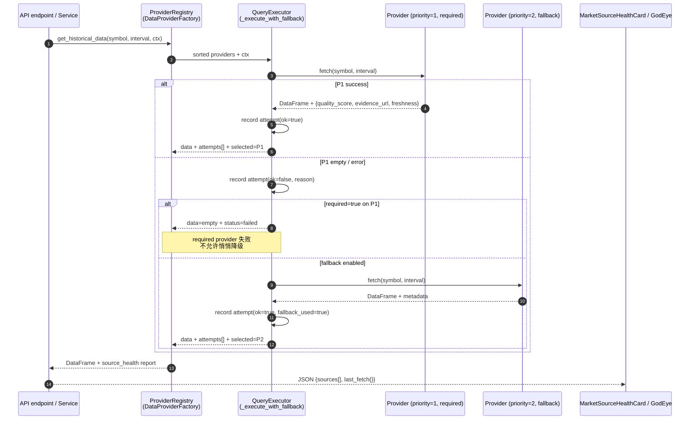

# ADR 0001 — Provider Abstraction Contract

- Status: Accepted
- Date: 2026-05-14
- Deciders: super-pricing-system maintainers
- Supersedes: —
- Related code: `src/data/providers/`, `src/data/alternative/`, `backend/app/api/v1/endpoints/macro_quality/`, `frontend/src/components/MarketSourceHealthCard.js`

## Context

`super-pricing-system` 现在已经有了三条彼此独立长出来的数据接入栈：

1. **行情/基本面 Provider** — `src/data/providers/` 下的 `BaseDataProvider` +
   `DataProviderFactory`。负责 OHLCV、quote、fundamentals，带优先级
   故障转移（`get_sorted_providers` + `_attach_source_health`）。
2. **另类数据 / GodEye 证据** — `src/data/alternative/` 下的
   `AltDataManager`、`people/provider.py`，已经在数据层产出
   `quality_score` / `freshness_label` / `freshness_weight` /
   `trust_score` / `tier` 等字段（见 `_build_freshness_meta`、
   `_infer_source_tier`）。
3. **macro 证据/政策时间线** — `backend/app/api/v1/endpoints/macro_quality/`、
   `macro_evidence.py`，对外暴露 evidence quality 指标，但取数来源在数据层
   是临时拼接的字段，没有正式契约。

最近合入的 PR（#50 `feat(frontend): add provider source health registry card`
+ `feat(data): expose market source health`）首次把 provider 元数据正规化为
对外 API：

- `DataProviderFactory.get_source_health_report` 输出形如：
  `{id, name, label, ok, status, reason, required, fallback,
   requires_api_key, priority, rate_limit, capabilities, checked_at}`
- `_record_fetch_health` 输出 per-request 的 attempt chain（`symbol`,
  `interval`, `status`, `selected_source`, `fallback_used`, `attempts[]`）。
- 前端 `MarketSourceHealthCard` 在 Quant Lab 面板里直接把这层契约渲染成卡片，
  并在标题打了 `<Tag>借鉴 OpenBB Registry</Tag>`。

下一步要做的工作（GodEye 多数据源融合、evidence quality 全链路一致化、
alt-data → 行情 provider 字段对齐）会牵动以上三条栈。如果不先把 Provider
契约固定下来，后面每加一个数据源都要重新发明一遍 quality/freshness/required
的语义。

### 为什么参考 OpenBB

[OpenBB Platform](https://github.com/OpenBB-finance/OpenBB) 的 provider 抽象
（`Fetcher` / `StandardModel` / `ProviderRegistry` / `QueryExecutor`）是目前
开源世界里一套较成熟、且常被参考的"多个金融数据源、统一标准字段、按需选择/降级"
架构。我们的现状本质上是一个雏形版本（Factory ≈ Registry，
`get_historical_data + fallback` ≈ QueryExecutor，`pd.DataFrame.attrs` ≈ ad-hoc
StandardModel），但层与层之间没有契约文档，也没有显式的标准模型类型。

**重要：本 ADR 只借鉴 OpenBB 的架构概念，不复制 OpenBB 代码、文档或字段定义。**
原因见下面的 License Note。

## Decision

采纳一份 **OpenBB-inspired 的 Provider 抽象契约**，把上面三条栈的语义统一到
一份合同上。本 ADR 只定义契约，**不引入 OpenBB 源码、不复制 OpenBB 的字段
schema、不依赖 OpenBB 的 PyPI 包**。

### Provider 契约的四层映射

| 概念层 | OpenBB 名词 | 本项目当前实现 | 本 ADR 后的目标实现 |
|---|---|---|---|
| **取数** | `Fetcher.fetch_data` | `BaseDataProvider.get_historical_data` / `get_latest_quote` / `get_fundamental_data` | 保留方法签名；要求实现者额外返回（或挂在 attrs 上）`quality_score` / `evidence_url` / `freshness` |
| **标准模型** | `StandardModel`（pydantic） | `pd.DataFrame` + `pd.DataFrame.attrs["source_health"]` + 朴素 dict | 新增 `src/data/providers/contracts.py`，用 `TypedDict` / `dataclass` 描述 `ProviderRecord`、`SourceHealthEntry`、`FetchAttempt`；行情层继续用 DataFrame，但 attrs 中的 dict 严格按 TypedDict 形状 |
| **注册表** | `ProviderRegistry` | `DataProviderFactory.PROVIDER_CLASSES` + `_initialize_providers` + `provider_events` | 保留；新增 `register(name, cls)` 公共 API（目前只有 class-level dict），允许 alt-data / macro 包注册自己的 provider |
| **查询执行** | `QueryExecutor` | `DataProviderFactory.get_historical_data`（含 sorted + fallback + `_record_fetch_health`） | 抽出 `_execute_with_fallback(operation, providers, ctx)` 一个内部 helper，让 quote / fundamentals / order_book 复用同一条 attempt chain，不再各自维护 try-except 链 |

### 标准字段语义

以下字段是 Provider 契约的**必选**部分：Phase 3 起新增 provider 必须实现或显式声明
`None`，存量 provider 在 Phase 3 PR 内补齐。`MarketSourceHealthCard` 已经消费其中一部分语义；GodEye `macro_quality` 面板将在 Phase 4 切换到同一套投影。

| 字段 | 类型 | 范围 | 含义 |
|---|---|---|---|
| `quality_score` | `float \| None` | `[0.0, 1.0]` | 单条数据的综合质量分。已有 `people_quality_score`、`avg_quality_score` 是该字段在 alt-data 域的特化。`None` 表示该 provider 不评估质量（如 commodity futures）。 |
| `evidence_url` | `str \| None` | 合法 URL 或 `None` | 指向**上游可被人工核验**的 canonical 链接（如雪球行情详情页、新浪财经新闻、统计局公告）。前端 `MarketSourceHealthCard` 与 GodEye 证据卡片需要它做 "点击查证" 入口。不暴露内部 API URL；Phase 3/4 实现时还必须加允许协议/域名白名单，避免 provider 把内部转发链接灌进 canonical URL。 |
| `freshness` | `dict \| None` | `{age_hours: float, label: 'fresh'\|'recent'\|'aging'\|'stale', weight: float}` | 与 `AltDataManager._build_freshness_meta` 已经一致：`fresh` = 24h, `recent` = 3d, `aging` = 7d, `stale` = >7d；`weight` ∈ {1.0, 0.75, 0.5, 0.25}。行情层 provider 需要把 K 线最后一根 bar 的时间戳折算成该结构。 |
| `required` | `bool` | — | 该 provider 是否是当前请求的"必须命中"源。`DataProviderFactory._provider_health_entry` 当前规则 `name == default` 保留，但 ADR 后允许 caller 在 `QueryContext` 里覆写（例如 cross-market 请求里 `us_stock` 为 required）。 |
| `fallback` | `bool` | — | 该 provider 是否作为降级候选。语义 = `(not ok) and fallback_enabled`（已实现）。Phase 4 新增约束：`required=true` 的 provider 失败时即便 `fallback=true` 也必须把 `status="failed"` 反映到上层响应，不允许悄悄返回降级源的数据；当前 Phase 1 不改变运行时行为。 |

附加（已有、不在本 ADR 改动范围）：`id` / `name` / `label` / `status` /
`reason` / `requires_api_key` / `priority` / `rate_limit` / `capabilities` /
`checked_at` —— 见 `DataProviderFactory._provider_health_entry`。

### 取数序列（含 fallback 与 quality）

## License Note — 为什么不直接装 OpenBB

OpenBB Platform 的许可证是 **AGPL-3.0**（参见
<https://github.com/OpenBB-finance/OpenBB/blob/develop/LICENSE>）。出于保守解读，AGPL-3.0
对网络服务有 copyleft 传染性：一旦本仓库的后端代码直接 `import openbb`
（即便只是 provider 抽象类），按 AGPL §13 的解读，整个 backend 在对外提供
研究 SPA 时都要以 AGPL 协议公开源代码——这超出了本项目的开源边界设定。

因此本 ADR 严格遵守以下界限：

1. **不引入 `openbb` / `openbb-core` / 任何 `openbb-*` PyPI 包作为依赖**。
2. **不复制 OpenBB 的类名、字段名、docstring 或测试 fixture**。本 ADR 中
   出现的"Fetcher / StandardModel / Registry / QueryExecutor"是公共架构术语，
   不构成原样照搬。
3. **不复制 OpenBB 的 README、ARCHITECTURE.md 或任何 markdown 长段落**。
4. 仅借鉴**架构思想**（分层、registry+executor 模式、standardized model
   字段集合），具体实现以本仓库现有的 `BaseDataProvider` / `DataProviderFactory`
   为出发点演进。

如果未来 OpenBB 改为 MIT/Apache-2.0 或推出独立 license 的 SDK 子包，本 ADR
可以重新评估。

## Migration Plan

切片节奏沿用 `REFACTORING_PLAN.md` 的规矩：每个 PR ≤600 行 relocation diff、
锁测试、零行为变更。

### Phase 1 — 契约文档化（本 PR）

- 落地本 ADR。
- **不改代码**，只把现有事实写成合同。后续 PR 引用本文件。

### Phase 2 — TypedDict / dataclass 抽出

- 新增 `src/data/providers/contracts.py`，把 `_provider_health_entry`、
  `_record_fetch_health`、`attempts` 的 dict 形状写成 `TypedDict`。
- mypy 增量门会校验（mypy baseline 当前 72，详见 `scripts/mypy_baseline_count.txt`，
  Phase 2 不应让 baseline 上涨）。
- 仅类型层改动，运行时零行为变化。

### Phase 3 — Provider 实现侧字段对齐

- `BaseDataProvider` 新增可选 hook：`get_record_metadata(record) -> ProviderRecord`，
  默认实现返回 `{quality_score: None, evidence_url: None, freshness: None}`。
- 行情 provider（Sina/Yahoo/AKShare）补 `freshness`（已有 timestamp，套
  `_build_freshness_meta`）。
- alt-data `people/provider.py` 把 `people_quality_score` rename / alias 到
  `quality_score`（保留兼容字段，按本仓库 backtest-result-contract.md 的
  "兼容别名" 模式）。

### Phase 4 — QueryExecutor 抽出 + macro 接入

- 把 `DataProviderFactory.get_historical_data` 里的 try-fallback-record 三段
  抽成 `_execute_with_fallback(operation, providers, ctx)`，让 `get_latest_quote`、
  `get_fundamental_data`、`get_order_book` 共用同一条 attempt chain。
- `backend/app/api/v1/endpoints/macro_quality/` 改为消费 `SourceHealthEntry`
  契约，而不是自己拼字段。

### Phase 5 — 前端契约消费收敛

- `MarketSourceHealthCard` 已经按这层契约渲染；GodEye 证据卡片切换到同样的
  `ProviderRecord` 投影，删除重复的归一化逻辑。
- 把用户可见 UI 中的 "OpenBB" 标签收敛为中性架构文案（例如 "Provider Registry"），
  保持 license note 的边界口径：实现和产品表面都只表达本项目自己的 provider contract。

## Risks

1. **AGPL 传染** —— 任何引入 OpenBB 代码片段的 PR 都会污染整个后端许可证。
   缓解：本 ADR 明文禁用 `openbb*` 依赖；CI 在 Phase 3 时加一个 license/import
   grep gate（"禁止 `import openbb`"），作为机械防线。
2. **契约扩散到 alt-data 之前的破坏性 rename** —— `people_quality_score` →
   `quality_score` 这种 rename 会牵动前端和 macro 因子计算。缓解：按本仓库
   惯用的"兼容别名 + 优先消费规范字段"模式（见 `docs/backtest-result-contract.md`
   §Trade Records），同时保留两个字段一个 deprecation 周期。
3. **行情 provider freshness 字段无法稳定计算** —— 实时报价拿到的时间戳可能
   是 provider 自己的服务器时间，与 UTC 偏差不可忽略；折算成 `age_hours` 时
   误差会被放大到 `weight` 上。缓解：Phase 3 的实现里 `age_hours` 用 max(0,
   …) 截断（已有），并在 ADR 0002（待写）里专门处理时区策略。
4. **Required/fallback 语义被旧 caller 误用** —— 目前 `required` 只在
   `_provider_health_entry` 内部根据 `name == default` 判定；如果 Phase 4
   允许 caller 在 ctx 里覆写，老的 endpoint 没传 ctx 时行为不能改变。缓解：
   `QueryContext` 默认值与现状完全一致，覆写是 additive。
5. **OpenAPI 契约抖动** —— 新增字段必须不破坏 `docs/openapi.json` baseline。
   缓解：Phase 2/3 每次 PR 跑 `python scripts/check_openapi_diff.py`；新增
   字段只能是 optional，不能改 required 集合或类型。

## References

- 本仓库现存契约：`DataProviderFactory._provider_health_entry`、
  `DataProviderFactory._record_fetch_health`、`AltDataManager._build_freshness_meta`、
  `frontend/src/utils/marketSourceHealth.js`。
- 既有结果契约范式：`docs/backtest-result-contract.md`。
- 重构纪律：`docs/REFACTORING_PLAN.md`、`CLAUDE.md` §Refactoring principles。
- 架构灵感（仅参考，不复制）：OpenBB Platform docs（AGPL-3.0，不引入依赖）。
